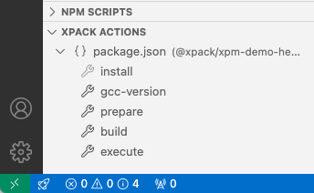

---

title: User's Guide
description: How to use xpm with existing xpm packages and how to create new packages.
keywords:
  - xpack
  - xpm
  - user
  - guide

date: 2024-11-24 11:22:00 +0200

---

import Tabs from '@theme/Tabs';
import TabItem from '@theme/TabItem';

{/* ------------------------------------------------------------------------ */}

# How to use xpm

This section is intended for those who plan to integrate **xpm**
into their workflows.

The first step in understanding **xpm** is learning how to manage
existing **xpm**-enabled projects. The subsequent steps involves
adding **xpm** metadata to existing projects or creating new ones.

## Use existing xpm-enabled projects

For projects that already include **xpm** metadata, the
basic **xpm** workflow consists of two primary tasks:

1. Installing **dependencies**
2. Running various actions related to key development tasks

The simplest way to experiment with this workflow is by using an
existing project. For example, you can start with a basic C project
that prints the traditional _"Hello, World!"_ message.

The first step is to clone the demo project into a temporary folder
of your choice:

```sh
git clone https://github.com/xpack/xpm-demo-hello1.git
```

### Install dependencies

The next major step in the workflow is to satisfy the project dependencies.
In this example, **xpm** will install **clang**
(since it is more portable than gcc).

```sh
cd xpm-demo-hello1
xpm install
```

:::info

It should be noted that this command will not install just any version of clang,
but a specific version (18.1.8 in this case), which is hard-coded into the
project metadata. This ensures that the same version is used across all
platforms, enhancing reproducibility.

:::

### Run actions

The next steps involve running several actions, beginning with
one that prepares the build folder:

```sh
xpm run prepare
```

The next action is to build the executable:

```sh
xpm run build
```

The final action is to execute the program:

```sh
xpm run execute
```

As expected, the result is:

```console
Hello World!
```

:::info

It should be noted that all these commands work the same on all
major platforms (Windows, macOS, and GNU/Linux).

:::


## Create new projects

As demonstrated, the workflow for using existing projects is straightforward.

However, for a more comprehensive understanding, it is beneficial to
learn how to create an **xpm**-enabled project from scratch and add the
necessary metadata. More details about xpm metadata can be found in the
[Package Author's Guide](/docs/guide/) pages.

### Initialise project

Similarly to **npm**, a project must be prepared for **xpm** use.

Run the `xpm init` command in a temporary folder of your choice:

```sh
mkdir xpm-demo-hello && cd xpm-demo-hello
xpm init
```

This adds an empty `package.json` where further metadata will be stored.

### Add source code

Add a simple C program that prints the traditional _Hello World!_ message:

```c title="xpm-demo-hello/src/hello.c"
#include <stdio.h>

int
main (int argc, char* argv[])
{
  printf ("Hello World!\n");

  return 0;
}
```

### Install a toolchain

To compile this C program, we'll use **clang 18**.

To install it, use the following command:

```sh
xpm install @xpack-dev-tools/clang@18.1.8-2.1
```

:::tip

**LLVM/clang** is preferred over **GCC** due to its greater compatibility.
As of this writing (November 2024), GCC on macOS has shown instability
across multiple SDK releases and is therefore not recommended.

:::

This command will add the following links to the project:

```console
% tree -a -L2 xpacks
xpacks
├── .bin
│   ├── analyze-build -> ../@xpack-dev-tools/clang/.content/bin/analyze-build
│   ├── clang -> ../@xpack-dev-tools/clang/.content/bin/clang
│   ├── clang++ -> ../@xpack-dev-tools/clang/.content/bin/clang++
│   ├── clang-check -> ../@xpack-dev-tools/clang/.content/bin/clang-check
│   ├── clang-cl -> ../@xpack-dev-tools/clang/.content/bin/clang-cl
│   ├── clang-cpp -> ../@xpack-dev-tools/clang/.content/bin/clang-cpp
│   ├── clang-doc -> ../@xpack-dev-tools/clang/.content/bin/clang-doc
│   ├── clang-format -> ../@xpack-dev-tools/clang/.content/bin/clang-format
│   ├── clang-include-cleaner -> ../@xpack-dev-tools/clang/.content/bin/clang-include-cleaner
│   ├── clang-linker-wrapper -> ../@xpack-dev-tools/clang/.content/bin/clang-linker-wrapper
│   ├── clang-refactor -> ../@xpack-dev-tools/clang/.content/bin/clang-refactor
│   ├── clang-rename -> ../@xpack-dev-tools/clang/.content/bin/clang-rename
│   ├── clang-repl -> ../@xpack-dev-tools/clang/.content/bin/clang-repl
│   ├── clang-scan-deps -> ../@xpack-dev-tools/clang/.content/bin/clang-scan-deps
│   ├── clang-tblgen -> ../@xpack-dev-tools/clang/.content/bin/clang-tblgen
│   ├── clang-tidy -> ../@xpack-dev-tools/clang/.content/bin/clang-tidy
│   ├── clangd -> ../@xpack-dev-tools/clang/.content/bin/clangd
│   ├── darwin-debug -> ../@xpack-dev-tools/clang/.content/bin/darwin-debug
│   ├── diagtool -> ../@xpack-dev-tools/clang/.content/bin/diagtool
│   ├── git-clang-format -> ../@xpack-dev-tools/clang/.content/bin/git-clang-format
│   ├── hmaptool -> ../@xpack-dev-tools/clang/.content/bin/hmaptool
│   ├── ld.lld -> ../@xpack-dev-tools/clang/.content/bin/ld.lld
│   ├── ld64.lld -> ../@xpack-dev-tools/clang/.content/bin/ld64.lld
│   ├── llc -> ../@xpack-dev-tools/clang/.content/bin/llc
│   ├── lld -> ../@xpack-dev-tools/clang/.content/bin/lld
│   ├── lld-link -> ../@xpack-dev-tools/clang/.content/bin/lld-link
│   ├── lldb -> ../@xpack-dev-tools/clang/.content/bin/lldb
│   ├── lldb-argdumper -> ../@xpack-dev-tools/clang/.content/bin/lldb-argdumper
│   ├── lldb-instr -> ../@xpack-dev-tools/clang/.content/bin/lldb-instr
│   ├── lldb-server -> ../@xpack-dev-tools/clang/.content/bin/lldb-server
│   ├── lli -> ../@xpack-dev-tools/clang/.content/bin/lli
│   ├── llvm-addr2line -> ../@xpack-dev-tools/clang/.content/bin/llvm-addr2line
│   ├── llvm-ar -> ../@xpack-dev-tools/clang/.content/bin/llvm-ar
│   ├── llvm-as -> ../@xpack-dev-tools/clang/.content/bin/llvm-as
│   ├── llvm-bitcode-strip -> ../@xpack-dev-tools/clang/.content/bin/llvm-bitcode-strip
│   ├── llvm-config -> ../@xpack-dev-tools/clang/.content/bin/llvm-config
│   ├── llvm-cov -> ../@xpack-dev-tools/clang/.content/bin/llvm-cov
│   ├── llvm-cxxdump -> ../@xpack-dev-tools/clang/.content/bin/llvm-cxxdump
│   ├── llvm-cxxfilt -> ../@xpack-dev-tools/clang/.content/bin/llvm-cxxfilt
│   ├── llvm-cxxmap -> ../@xpack-dev-tools/clang/.content/bin/llvm-cxxmap
│   ├── llvm-debuginfo-analyzer -> ../@xpack-dev-tools/clang/.content/bin/llvm-debuginfo-analyzer
│   ├── llvm-debuginfod -> ../@xpack-dev-tools/clang/.content/bin/llvm-debuginfod
│   ├── llvm-debuginfod-find -> ../@xpack-dev-tools/clang/.content/bin/llvm-debuginfod-find
│   ├── llvm-diff -> ../@xpack-dev-tools/clang/.content/bin/llvm-diff
│   ├── llvm-dis -> ../@xpack-dev-tools/clang/.content/bin/llvm-dis
│   ├── llvm-dlltool -> ../@xpack-dev-tools/clang/.content/bin/llvm-dlltool
│   ├── llvm-dwarfutil -> ../@xpack-dev-tools/clang/.content/bin/llvm-dwarfutil
│   ├── llvm-lib -> ../@xpack-dev-tools/clang/.content/bin/llvm-lib
│   ├── llvm-libtool-darwin -> ../@xpack-dev-tools/clang/.content/bin/llvm-libtool-darwin
│   ├── llvm-nm -> ../@xpack-dev-tools/clang/.content/bin/llvm-nm
│   ├── llvm-objcopy -> ../@xpack-dev-tools/clang/.content/bin/llvm-objcopy
│   ├── llvm-objdump -> ../@xpack-dev-tools/clang/.content/bin/llvm-objdump
│   ├── llvm-otool -> ../@xpack-dev-tools/clang/.content/bin/llvm-otool
│   ├── llvm-profdata -> ../@xpack-dev-tools/clang/.content/bin/llvm-profdata
│   ├── llvm-ranlib -> ../@xpack-dev-tools/clang/.content/bin/llvm-ranlib
│   ├── llvm-rc -> ../@xpack-dev-tools/clang/.content/bin/llvm-rc
│   ├── llvm-readelf -> ../@xpack-dev-tools/clang/.content/bin/llvm-readelf
│   ├── llvm-readobj -> ../@xpack-dev-tools/clang/.content/bin/llvm-readobj
│   ├── llvm-remarkutil -> ../@xpack-dev-tools/clang/.content/bin/llvm-remarkutil
│   ├── llvm-sim -> ../@xpack-dev-tools/clang/.content/bin/llvm-sim
│   ├── llvm-size -> ../@xpack-dev-tools/clang/.content/bin/llvm-size
│   ├── llvm-strings -> ../@xpack-dev-tools/clang/.content/bin/llvm-strings
│   ├── llvm-strip -> ../@xpack-dev-tools/clang/.content/bin/llvm-strip
│   ├── llvm-symbolizer -> ../@xpack-dev-tools/clang/.content/bin/llvm-symbolizer
│   ├── llvm-tblgen -> ../@xpack-dev-tools/clang/.content/bin/llvm-tblgen
│   ├── llvm-tli-checker -> ../@xpack-dev-tools/clang/.content/bin/llvm-tli-checker
│   ├── llvm-windres -> ../@xpack-dev-tools/clang/.content/bin/llvm-windres
│   ├── run-clang-tidy -> ../@xpack-dev-tools/clang/.content/bin/run-clang-tidy
│   ├── scan-build-py -> ../@xpack-dev-tools/clang/.content/bin/scan-build-py
│   ├── set-xcode-analyzer -> ../@xpack-dev-tools/clang/.content/bin/set-xcode-analyzer
│   ├── split-file -> ../@xpack-dev-tools/clang/.content/bin/split-file
│   └── wasm-ld -> ../@xpack-dev-tools/clang/.content/bin/wasm-ld
└── @xpack-dev-tools
    └── clang -> /Users/ilg/Library/xPacks/@xpack-dev-tools/clang/18.1.8-2.1

4 directories, 72 files
```

This command will also remeber the actual **clang** version in the
`xpacks.devDependencies` section of `package.json`, ensuring that
the project is locked to this version:

```json {4-7}
{
  "xpacks": {
    "devDependencies": {
      "@xpack-dev-tools/clang": {
        "specifier": "18.1.8-2.1",
        "local": "link",
        "platforms": "all"
      }
    },
  }
}
```

<Tabs groupId="operating-systems">

<TabItem value="windows" label="Windows" default>


:::note

On Windows, where symbolic links to files are problematic, forwarders/shims
are used. For example:

```console
...
│       clang
│       clang.cmd
│       clang.ps1
```

:::

To test if `clang` starts properly, invoke it via the shim in the
`.bin` folder:

```console
PS C:\Users\ilg\xpm-demo-hello> .\xpacks\.bin\clang --version
xPack x86_64 clang version 18.1.8
```

</TabItem>

<TabItem value="macos" label="macOS">

To test if `clang` starts properly, invoke it via the link in the
`.bin` folder:

```console
% ./xpacks/.bin/clang --version
xPack x86_64 clang version 18.1.8
```

</TabItem>

<TabItem value="linux" label="GNU/Linux">

To test if `clang` starts properly, invoke it via the link in the
`.bin` folder:

```console
$ ./xpacks/.bin/clang --version
xPack x86_64 clang version 18.1.8
```

</TabItem>

</Tabs>


### Add actions

In traditional development environments, adding `xpacks/.bin` to the
`PATH` is sufficient to allow any build tools to access the installed
executables.

However, the workflow can be further automated, by starting the build tools
via `xpm run`, which automatically manages the `PATH`.

To experiment with this, edit `package.json` and add a
`clang --version` command in the
`xpack.actions` section, with a name (for example `cc-version`):

```json {4}
{
  "xpacks": {
    "actions": {
      "cc-version": "clang --version"
    }
  }
}
```

With this definition, the compiler version can be displayed without manually
entering the path:

<Tabs groupId="operating-systems">

<TabItem value="windows" label="Windows" default>

```console
PS C:\Users\ilg\xpm-demo-hello> xpm run cc-version
> clang --version
xPack x86_64 clang version 18.1.8
```

</TabItem>

<TabItem value="macos" label="macOS">

```console
% xpm run cc-version
> clang --version
xPack x86_64 clang version 18.1.8
```

</TabItem>

<TabItem value="linux" label="GNU/Linux">

```console
$ xpm run cc-version
> clang --version
xPack x86_64 clang version 18.1.8
```

</TabItem>

</Tabs>

Once the compiler is functional, additional xpack.actions can be
added to manage essential tasks such as preparing the build
environment, performing the build, and executing the resulting program:

```json {5-7}
{
  "xpacks": {
    "actions": {
      "cc-version": "clang --version",
      "prepare": "mkdir build",
      "build": "clang src/hello.c -o build/hello",
      "execute": "build{{path.sep}}hello"
    }
  }
}
```

:::tip[Tip 1]

The `{{path.sep}}` syntax is a LiquidJS substitution used to
accommodate platform-specific path separators. It is necessary
in the command passed via `execute` because it is parsed by the system shell.
However, it is not required in the `compile` as the toolchain also
understands POSIX paths.

:::

:::tip[Tip 2]

In this simple demo case, the `prepare` action is straightforward and can
be directly executed in the terminal. However, for real-life projects,
preparing the build often involves using tools like CMake or meson.
Therefore, it is recommended as a best practice to always define a
`prepare` action.

:::

With these actions defined, the workflow becomes:

<Tabs groupId="operating-systems">

<TabItem value="windows" label="Windows" default>

```console
PS C:\Users\ilg\xpm-demo-hello> xpm run prepare
> mkdir build

PS C:\Users\ilg\xpm-demo-hello> xpm run build
> clang src/hello.c -o build/hello

PS C:\Users\ilg\xpm-demo-hello> xpm run execute
> build\hello
Hello World!
```

</TabItem>

<TabItem value="macos" label="macOS">

```console
% xpm run prepare
> mkdir build

% xpm run build
> clang src/hello.c -o build/hello

% xpm run execute
> build/hello
Hello World!
```

</TabItem>

<TabItem value="linux" label="GNU/Linux">

```console
$ xpm run prepare
> mkdir build

$ xpm run build
> clang src/hello.c -o build/hello

$ xpm run execute
> build/hello
Hello World!
```

</TabItem>

</Tabs>

## Visual Studio Code

For convenience, when using
[Visual Studio Code](https://code.visualstudio.com) with the
[xPack C/C++ Managed Build Tools](https://marketplace.visualstudio.com/items?itemName=ilg-vscode.xpack) extension,
the actions are displayed in the bottom left corner and can be executed
with a single mouse click.



## Instantiate a template

While the resulting projects above are functional, they remain quite simple.

A real-world project will likely have multiple configurations, at least
to build separate debug and release executables, and possibly to run
tests in various environments.

Additionally, more complex projects will probably use tools like
**CMake** or **meson**.

These types of projects can be created manually, but the process can
be further automated by using project templates.

To generate the traditional _"Hello World!"_ project, there is an
[xpack/hello-world-template-xpack](https://github.com/xpack/hello-world-template-xpack)
project, also available from npmjs.com as
[@xpack/hello-world-template](https://www.npmjs.com/package/@xpack/hello-world-template).

Both C and C++ are supported, with **CMake** and **meson** as build system
generators.

Instantiating the template in interactive mode looks like this:

```console
% mkdir my-project && cd my-project
% xpm init --template @xpack/hello-world-template@latest

Checking package @xpack/hello-world-template@latest metadata...
Processing @xpack/hello-world-template@0.6.1...

Programming language? (c, cpp, ?) [cpp]: c
Build System? (cmake, meson, autotools, ?) [cmake]:
Toolchain? (gcc, clang, system, ?) [gcc]: clang
Creating the C project 'my-project'...
File 'include/hello-world.h' copied.
File 'src/hello-world.c' copied.
File 'libs/adder/include/add/add.h' copied.
File 'libs/adder/src/add.c' copied.
Folder 'cmake' copied.
File 'CMakeLists.txt' generated.
File '.vscode/tasks.json' copied.
File '.vscode/settings.json' copied.
File '.gitignore' copied.
File '.npmignore' copied.
File 'README.md' generated.
File 'LICENSE' generated.
File 'package.json' generated.
```

:::tip

As mentioned before, for portability reasons it is recommended to use clang.

:::

The next step is to satisfy the project dependencies:

```console
% xpm install
@my-scope/my-project...
+ @xpack-dev-tools/ninja-build@1.11.1-3.1
+ @xpack-dev-tools/cmake@3.28.6-1.1
+ @xpack-dev-tools/clang@18.1.8-2.1
'xpacks/@xpack-dev-tools/cmake' -> '/Users/ilg/Library/xPacks/@xpack-dev-tools/cmake/3.28.6-1.1'
'xpacks/@xpack-dev-tools/clang' -> '/Users/ilg/Library/xPacks/@xpack-dev-tools/clang/18.1.8-2.1'
'xpacks/.bin/ccmake' -> '../@xpack-dev-tools/cmake/.content/bin/ccmake'
'xpacks/@xpack-dev-tools/ninja-build' -> '/Users/ilg/Library/xPacks/@xpack-dev-tools/ninja-build/1.11.1-3.1'
'xpacks/.bin/analyze-build' -> '../@xpack-dev-tools/clang/.content/bin/analyze-build'
'xpacks/.bin/cmake' -> '../@xpack-dev-tools/cmake/.content/bin/cmake'
'xpacks/.bin/clang' -> '../@xpack-dev-tools/clang/.content/bin/clang'
'xpacks/.bin/ninja' -> '../@xpack-dev-tools/ninja-build/.content/bin/ninja'
'xpacks/.bin/cpack' -> '../@xpack-dev-tools/cmake/.content/bin/cpack'
'xpacks/.bin/clang++' -> '../@xpack-dev-tools/clang/.content/bin/clang++'
'xpacks/.bin/ctest' -> '../@xpack-dev-tools/cmake/.content/bin/ctest'
'xpacks/.bin/clang-check' -> '../@xpack-dev-tools/clang/.content/bin/clang-check'
'xpacks/.bin/clang-cl' -> '../@xpack-dev-tools/clang/.content/bin/clang-cl'
'xpacks/.bin/clang-cpp' -> '../@xpack-dev-tools/clang/.content/bin/clang-cpp'
'xpacks/.bin/clang-doc' -> '../@xpack-dev-tools/clang/.content/bin/clang-doc'
'xpacks/.bin/clang-format' -> '../@xpack-dev-tools/clang/.content/bin/clang-format'
'xpacks/.bin/clang-include-cleaner' -> '../@xpack-dev-tools/clang/.content/bin/clang-include-cleaner'
'xpacks/.bin/clang-linker-wrapper' -> '../@xpack-dev-tools/clang/.content/bin/clang-linker-wrapper'
'xpacks/.bin/clang-refactor' -> '../@xpack-dev-tools/clang/.content/bin/clang-refactor'
'xpacks/.bin/clang-rename' -> '../@xpack-dev-tools/clang/.content/bin/clang-rename'
'xpacks/.bin/clang-repl' -> '../@xpack-dev-tools/clang/.content/bin/clang-repl'
'xpacks/.bin/clang-scan-deps' -> '../@xpack-dev-tools/clang/.content/bin/clang-scan-deps'
'xpacks/.bin/clang-tblgen' -> '../@xpack-dev-tools/clang/.content/bin/clang-tblgen'
'xpacks/.bin/clang-tidy' -> '../@xpack-dev-tools/clang/.content/bin/clang-tidy'
'xpacks/.bin/clangd' -> '../@xpack-dev-tools/clang/.content/bin/clangd'
'xpacks/.bin/darwin-debug' -> '../@xpack-dev-tools/clang/.content/bin/darwin-debug'
'xpacks/.bin/diagtool' -> '../@xpack-dev-tools/clang/.content/bin/diagtool'
'xpacks/.bin/git-clang-format' -> '../@xpack-dev-tools/clang/.content/bin/git-clang-format'
'xpacks/.bin/hmaptool' -> '../@xpack-dev-tools/clang/.content/bin/hmaptool'
'xpacks/.bin/ld.lld' -> '../@xpack-dev-tools/clang/.content/bin/ld.lld'
'xpacks/.bin/ld64.lld' -> '../@xpack-dev-tools/clang/.content/bin/ld64.lld'
'xpacks/.bin/llc' -> '../@xpack-dev-tools/clang/.content/bin/llc'
'xpacks/.bin/lld' -> '../@xpack-dev-tools/clang/.content/bin/lld'
'xpacks/.bin/lld-link' -> '../@xpack-dev-tools/clang/.content/bin/lld-link'
'xpacks/.bin/lldb' -> '../@xpack-dev-tools/clang/.content/bin/lldb'
'xpacks/.bin/lldb-argdumper' -> '../@xpack-dev-tools/clang/.content/bin/lldb-argdumper'
'xpacks/.bin/lldb-instr' -> '../@xpack-dev-tools/clang/.content/bin/lldb-instr'
'xpacks/.bin/lldb-server' -> '../@xpack-dev-tools/clang/.content/bin/lldb-server'
'xpacks/.bin/lli' -> '../@xpack-dev-tools/clang/.content/bin/lli'
'xpacks/.bin/llvm-addr2line' -> '../@xpack-dev-tools/clang/.content/bin/llvm-addr2line'
'xpacks/.bin/llvm-ar' -> '../@xpack-dev-tools/clang/.content/bin/llvm-ar'
'xpacks/.bin/llvm-as' -> '../@xpack-dev-tools/clang/.content/bin/llvm-as'
'xpacks/.bin/llvm-bitcode-strip' -> '../@xpack-dev-tools/clang/.content/bin/llvm-bitcode-strip'
'xpacks/.bin/llvm-config' -> '../@xpack-dev-tools/clang/.content/bin/llvm-config'
'xpacks/.bin/llvm-cov' -> '../@xpack-dev-tools/clang/.content/bin/llvm-cov'
'xpacks/.bin/llvm-cxxdump' -> '../@xpack-dev-tools/clang/.content/bin/llvm-cxxdump'
'xpacks/.bin/llvm-cxxfilt' -> '../@xpack-dev-tools/clang/.content/bin/llvm-cxxfilt'
'xpacks/.bin/llvm-cxxmap' -> '../@xpack-dev-tools/clang/.content/bin/llvm-cxxmap'
'xpacks/.bin/llvm-debuginfo-analyzer' -> '../@xpack-dev-tools/clang/.content/bin/llvm-debuginfo-analyzer'
'xpacks/.bin/llvm-debuginfod' -> '../@xpack-dev-tools/clang/.content/bin/llvm-debuginfod'
'xpacks/.bin/llvm-debuginfod-find' -> '../@xpack-dev-tools/clang/.content/bin/llvm-debuginfod-find'
'xpacks/.bin/llvm-diff' -> '../@xpack-dev-tools/clang/.content/bin/llvm-diff'
'xpacks/.bin/llvm-dis' -> '../@xpack-dev-tools/clang/.content/bin/llvm-dis'
'xpacks/.bin/llvm-dlltool' -> '../@xpack-dev-tools/clang/.content/bin/llvm-dlltool'
'xpacks/.bin/llvm-dwarfutil' -> '../@xpack-dev-tools/clang/.content/bin/llvm-dwarfutil'
'xpacks/.bin/llvm-lib' -> '../@xpack-dev-tools/clang/.content/bin/llvm-lib'
'xpacks/.bin/llvm-libtool-darwin' -> '../@xpack-dev-tools/clang/.content/bin/llvm-libtool-darwin'
'xpacks/.bin/llvm-nm' -> '../@xpack-dev-tools/clang/.content/bin/llvm-nm'
'xpacks/.bin/llvm-objcopy' -> '../@xpack-dev-tools/clang/.content/bin/llvm-objcopy'
'xpacks/.bin/llvm-objdump' -> '../@xpack-dev-tools/clang/.content/bin/llvm-objdump'
'xpacks/.bin/llvm-otool' -> '../@xpack-dev-tools/clang/.content/bin/llvm-otool'
'xpacks/.bin/llvm-profdata' -> '../@xpack-dev-tools/clang/.content/bin/llvm-profdata'
'xpacks/.bin/llvm-ranlib' -> '../@xpack-dev-tools/clang/.content/bin/llvm-ranlib'
'xpacks/.bin/llvm-rc' -> '../@xpack-dev-tools/clang/.content/bin/llvm-rc'
'xpacks/.bin/llvm-readelf' -> '../@xpack-dev-tools/clang/.content/bin/llvm-readelf'
'xpacks/.bin/llvm-readobj' -> '../@xpack-dev-tools/clang/.content/bin/llvm-readobj'
'xpacks/.bin/llvm-remarkutil' -> '../@xpack-dev-tools/clang/.content/bin/llvm-remarkutil'
'xpacks/.bin/llvm-sim' -> '../@xpack-dev-tools/clang/.content/bin/llvm-sim'
'xpacks/.bin/llvm-size' -> '../@xpack-dev-tools/clang/.content/bin/llvm-size'
'xpacks/.bin/llvm-strings' -> '../@xpack-dev-tools/clang/.content/bin/llvm-strings'
'xpacks/.bin/llvm-strip' -> '../@xpack-dev-tools/clang/.content/bin/llvm-strip'
'xpacks/.bin/llvm-symbolizer' -> '../@xpack-dev-tools/clang/.content/bin/llvm-symbolizer'
'xpacks/.bin/llvm-tblgen' -> '../@xpack-dev-tools/clang/.content/bin/llvm-tblgen'
'xpacks/.bin/llvm-tli-checker' -> '../@xpack-dev-tools/clang/.content/bin/llvm-tli-checker'
'xpacks/.bin/llvm-windres' -> '../@xpack-dev-tools/clang/.content/bin/llvm-windres'
'xpacks/.bin/run-clang-tidy' -> '../@xpack-dev-tools/clang/.content/bin/run-clang-tidy'
'xpacks/.bin/scan-build-py' -> '../@xpack-dev-tools/clang/.content/bin/scan-build-py'
'xpacks/.bin/set-xcode-analyzer' -> '../@xpack-dev-tools/clang/.content/bin/set-xcode-analyzer'
'xpacks/.bin/split-file' -> '../@xpack-dev-tools/clang/.content/bin/split-file'
'xpacks/.bin/wasm-ld' -> '../@xpack-dev-tools/clang/.content/bin/wasm-ld'
```

The final step is to run the tests:

```console
% xpm run test-all
> xpm run test-debug
> xpm run prepare --config debug
> cmake -S . -B build/debug -G Ninja  -D CMAKE_BUILD_TYPE=Debug -D CMAKE_EXPORT_COMPILE_COMMANDS=ON -D CMAKE_TOOLCHAIN_FILE=cmake/toolchains/clang.cmake
-- The C compiler identification is Clang 18.1.8
-- The CXX compiler identification is Clang 18.1.8
-- Detecting C compiler ABI info
-- Detecting C compiler ABI info - done
-- Check for working C compiler: /Users/ilg/tmp/my-project/xpacks/.bin/clang - skipped
-- Detecting C compile features
-- Detecting C compile features - done
-- Detecting CXX compiler ABI info
-- Detecting CXX compiler ABI info - done
-- Check for working CXX compiler: /Users/ilg/tmp/my-project/xpacks/.bin/clang++ - skipped
-- Detecting CXX compile features
-- Detecting CXX compile features - done
-- The ASM compiler identification is Clang with GNU-like command-line
-- Found assembler: /Users/ilg/tmp/my-project/xpacks/.bin/clang
-- Build type: Debug
-- Project path: /Users/ilg/tmp/my-project
-- PATH: /Users/ilg/tmp/my-project/xpacks/.bin:/Users/ilg/tmp/my-project/xpacks/.bin:/Users/ilg/tmp/my-project/xpacks/.bin:/Users/ilg/.nvm/versions/node/v22.11.0/bin:/usr/local/bin:/System/Cryptexes/App/usr/bin:/usr/bin:/bin:/usr/sbin:/sbin:/var/run/com.apple.security.cryptexd/codex.system/bootstrap/usr/local/bin:/var/run/com.apple.security.cryptexd/codex.system/bootstrap/usr/bin:/var/run/com.apple.security.cryptexd/codex.system/bootstrap/usr/appleinternal/bin
-- CMake version: 3.28.6
-- Compiler: Clang 18.1.8
-- A> hello-world
-- Configuring done (2.5s)
-- Generating done (0.0s)
-- Build files have been written to: /Users/ilg/tmp/my-project/build/debug
> xpm run build --config debug
> cmake -S . -B build/debug -G Ninja  -D CMAKE_BUILD_TYPE=Debug -D CMAKE_EXPORT_COMPILE_COMMANDS=ON
-- Build type: Debug
-- Project path: /Users/ilg/tmp/my-project
-- PATH: /Users/ilg/tmp/my-project/xpacks/.bin:/Users/ilg/tmp/my-project/xpacks/.bin:/Users/ilg/tmp/my-project/xpacks/.bin:/Users/ilg/.nvm/versions/node/v22.11.0/bin:/usr/local/bin:/System/Cryptexes/App/usr/bin:/usr/bin:/bin:/usr/sbin:/sbin:/var/run/com.apple.security.cryptexd/codex.system/bootstrap/usr/local/bin:/var/run/com.apple.security.cryptexd/codex.system/bootstrap/usr/bin:/var/run/com.apple.security.cryptexd/codex.system/bootstrap/usr/appleinternal/bin
-- CMake version: 3.28.6
-- Compiler: Clang 18.1.8
-- A> hello-world
-- Configuring done (0.2s)
-- Generating done (0.0s)
-- Build files have been written to: /Users/ilg/tmp/my-project/build/debug
> cmake --build build/debug --verbose
Change Dir: '/Users/ilg/tmp/my-project/build/debug'

Run Build Command(s): /Users/ilg/tmp/my-project/xpacks/.bin/ninja -v
[1/3] /Users/ilg/tmp/my-project/xpacks/.bin/clang -DDEBUG -I/Users/ilg/tmp/my-project/include -I/Users/ilg/tmp/my-project/libs/adder/include -O0 -g3 -std=c11 -isysroot /Library/Developer/CommandLineTools/SDKs/MacOSX14.4.sdk -fmessage-length=0 -fsigned-char -ffunction-sections -fdata-sections -flto -MD -MT CMakeFiles/hello-world.dir/libs/adder/src/add.c.o -MF CMakeFiles/hello-world.dir/libs/adder/src/add.c.o.d -o CMakeFiles/hello-world.dir/libs/adder/src/add.c.o -c /Users/ilg/tmp/my-project/libs/adder/src/add.c
[2/3] /Users/ilg/tmp/my-project/xpacks/.bin/clang -DDEBUG -I/Users/ilg/tmp/my-project/include -I/Users/ilg/tmp/my-project/libs/adder/include -O0 -g3 -std=c11 -isysroot /Library/Developer/CommandLineTools/SDKs/MacOSX14.4.sdk -fmessage-length=0 -fsigned-char -ffunction-sections -fdata-sections -flto -MD -MT CMakeFiles/hello-world.dir/src/hello-world.c.o -MF CMakeFiles/hello-world.dir/src/hello-world.c.o.d -o CMakeFiles/hello-world.dir/src/hello-world.c.o -c /Users/ilg/tmp/my-project/src/hello-world.c
[3/3] : && /Users/ilg/tmp/my-project/xpacks/.bin/clang -O0 -g3 -isysroot /Library/Developer/CommandLineTools/SDKs/MacOSX14.4.sdk -Wl,-search_paths_first -Wl,-headerpad_max_install_names -fmessage-length=0 -fsigned-char -ffunction-sections -fdata-sections -flto -Wl,-dead_strip CMakeFiles/hello-world.dir/src/hello-world.c.o CMakeFiles/hello-world.dir/libs/adder/src/add.c.o -o hello-world   && :
-macosx_version_min has been renamed to -macos_version_min
-macosx_version_min has been renamed to -macos_version_min

> xpm run execute --config debug
> build/debug/hello-world
Hello World!
(in debug mode)
Check adder lib: 41 + 1 = 42
> xpm run test-release
> xpm run prepare --config release
> cmake -S . -B build/release -G Ninja  -D CMAKE_BUILD_TYPE=Release -D CMAKE_EXPORT_COMPILE_COMMANDS=ON -D CMAKE_TOOLCHAIN_FILE=cmake/toolchains/clang.cmake
-- The C compiler identification is Clang 18.1.8
-- The CXX compiler identification is Clang 18.1.8
-- Detecting C compiler ABI info
-- Detecting C compiler ABI info - done
-- Check for working C compiler: /Users/ilg/tmp/my-project/xpacks/.bin/clang - skipped
-- Detecting C compile features
-- Detecting C compile features - done
-- Detecting CXX compiler ABI info
-- Detecting CXX compiler ABI info - done
-- Check for working CXX compiler: /Users/ilg/tmp/my-project/xpacks/.bin/clang++ - skipped
-- Detecting CXX compile features
-- Detecting CXX compile features - done
-- The ASM compiler identification is Clang with GNU-like command-line
-- Found assembler: /Users/ilg/tmp/my-project/xpacks/.bin/clang
-- Build type: Release
-- Project path: /Users/ilg/tmp/my-project
-- PATH: /Users/ilg/tmp/my-project/xpacks/.bin:/Users/ilg/tmp/my-project/xpacks/.bin:/Users/ilg/tmp/my-project/xpacks/.bin:/Users/ilg/.nvm/versions/node/v22.11.0/bin:/usr/local/bin:/System/Cryptexes/App/usr/bin:/usr/bin:/bin:/usr/sbin:/sbin:/var/run/com.apple.security.cryptexd/codex.system/bootstrap/usr/local/bin:/var/run/com.apple.security.cryptexd/codex.system/bootstrap/usr/bin:/var/run/com.apple.security.cryptexd/codex.system/bootstrap/usr/appleinternal/bin
-- CMake version: 3.28.6
-- Compiler: Clang 18.1.8
-- A> hello-world
-- Configuring done (2.3s)
-- Generating done (0.0s)
-- Build files have been written to: /Users/ilg/tmp/my-project/build/release
> xpm run build --config release
> cmake -S . -B build/release -G Ninja  -D CMAKE_BUILD_TYPE=Release -D CMAKE_EXPORT_COMPILE_COMMANDS=ON
-- Build type: Release
-- Project path: /Users/ilg/tmp/my-project
-- PATH: /Users/ilg/tmp/my-project/xpacks/.bin:/Users/ilg/tmp/my-project/xpacks/.bin:/Users/ilg/tmp/my-project/xpacks/.bin:/Users/ilg/.nvm/versions/node/v22.11.0/bin:/usr/local/bin:/System/Cryptexes/App/usr/bin:/usr/bin:/bin:/usr/sbin:/sbin:/var/run/com.apple.security.cryptexd/codex.system/bootstrap/usr/local/bin:/var/run/com.apple.security.cryptexd/codex.system/bootstrap/usr/bin:/var/run/com.apple.security.cryptexd/codex.system/bootstrap/usr/appleinternal/bin
-- CMake version: 3.28.6
-- Compiler: Clang 18.1.8
-- A> hello-world
-- Configuring done (0.1s)
-- Generating done (0.0s)
-- Build files have been written to: /Users/ilg/tmp/my-project/build/release
> cmake --build build/release --verbose
Change Dir: '/Users/ilg/tmp/my-project/build/release'

Run Build Command(s): /Users/ilg/tmp/my-project/xpacks/.bin/ninja -v
[1/3] /Users/ilg/tmp/my-project/xpacks/.bin/clang  -I/Users/ilg/tmp/my-project/include -I/Users/ilg/tmp/my-project/libs/adder/include -O3 -DNDEBUG -std=c11 -isysroot /Library/Developer/CommandLineTools/SDKs/MacOSX14.4.sdk -fmessage-length=0 -fsigned-char -ffunction-sections -fdata-sections -flto -MD -MT CMakeFiles/hello-world.dir/libs/adder/src/add.c.o -MF CMakeFiles/hello-world.dir/libs/adder/src/add.c.o.d -o CMakeFiles/hello-world.dir/libs/adder/src/add.c.o -c /Users/ilg/tmp/my-project/libs/adder/src/add.c
[2/3] /Users/ilg/tmp/my-project/xpacks/.bin/clang  -I/Users/ilg/tmp/my-project/include -I/Users/ilg/tmp/my-project/libs/adder/include -O3 -DNDEBUG -std=c11 -isysroot /Library/Developer/CommandLineTools/SDKs/MacOSX14.4.sdk -fmessage-length=0 -fsigned-char -ffunction-sections -fdata-sections -flto -MD -MT CMakeFiles/hello-world.dir/src/hello-world.c.o -MF CMakeFiles/hello-world.dir/src/hello-world.c.o.d -o CMakeFiles/hello-world.dir/src/hello-world.c.o -c /Users/ilg/tmp/my-project/src/hello-world.c
[3/3] : && /Users/ilg/tmp/my-project/xpacks/.bin/clang -O3 -DNDEBUG -isysroot /Library/Developer/CommandLineTools/SDKs/MacOSX14.4.sdk -Wl,-search_paths_first -Wl,-headerpad_max_install_names -fmessage-length=0 -fsigned-char -ffunction-sections -fdata-sections -flto -Wl,-dead_strip CMakeFiles/hello-world.dir/src/hello-world.c.o CMakeFiles/hello-world.dir/libs/adder/src/add.c.o -o hello-world   && :
-macosx_version_min has been renamed to -macos_version_min
-macosx_version_min has been renamed to -macos_version_min

> xpm run execute --config release
> build/release/hello-world
Hello World!
(in release mode)
(no asserts)
Check adder lib: 41 + 1 = 42
```

## Final considerations

The **xpm** workflow described above can be successfully applied
for various types of projects::

-  **Source code libraries**: Projects that can be included as
dependencies in other projects.
-  **Projects with executables**: Projects that provide development
tools and can also be included as dependencies in other projects.
-  **Final projects**: Projects that produce various artifacts
that run natively or on embedded platforms.

Understanding the mechanism for defining `xpack.actions` enables the
implementation of highly complex workflows. For instance, intricate
build configurations can be created for elaborate multi-platform tests.

For final projects not intended to be used as dependencies in other
projects, having complex logic in the top-level `package.json` is not
a significant issue.

However, for projects intended to be used as dependencies, it is
advisable to keep only user-related metadata in the top-level
`package.json` and move all development metadata to separate folders.

### Use separate `tests/package.json`

To reduce the clutter, it is recommended to move all test-related metadata
to a separate `tests` folder, with its own `package.json`.

### Use separate `build_assets/package.json`

Similarly, if the project produces executables to be used as dependencies,
it is recommended to move all build related files into a separate folder,
for example `build-assets`, with its own `package.json`.
